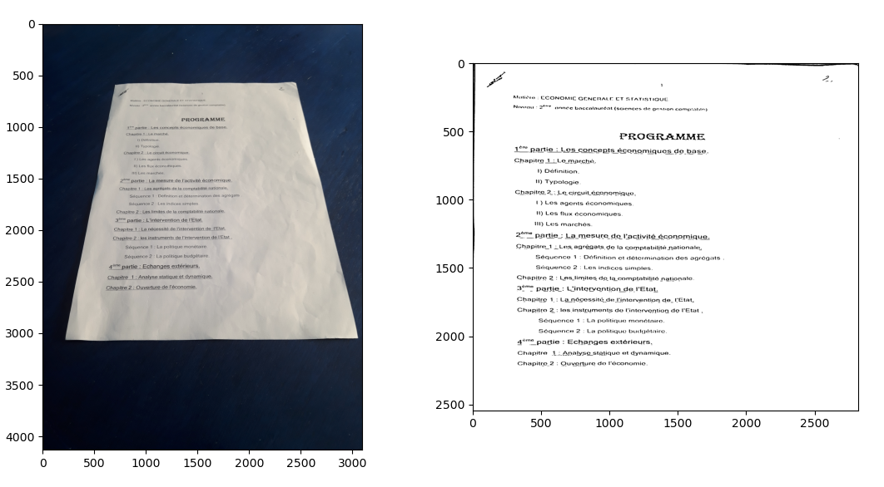

# OCR-Scanner

Context
----
OCR Scanner allows to convert document photos into scanned document pdf (binary format).

  

REMARK:
----
The result of OCR Scanner can be used as an input to a to a photo OCR PIPELINE.
